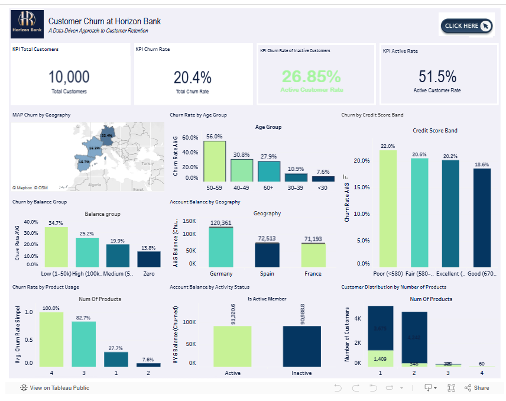

# Customer Churn at Horizon Bank
### A Data-Driven Approach to Customer Retention

## SECTION 1: PROJECT SUMMARY FOR PORTFOLIO
### Summary/Context 
Horizon Bank faces a significant 20.4% customer churn rate across 10,000 customers in France, Germany, and Spain. This attrition poses a direct threat to long-term profitability and revenue stability. The project analyzes customer profiles, financial behaviors, and engagement patterns to identify key drivers of churn and support data-informed retention strategies.

### Goals 
The primary objective is to identify the key factors associated with customer churn at Horizon Bank. By examining data from France, Germany, and Spain, the study aims to uncover root causes related to customer profiles, financial behavior, and product usage. These insights are intended to support the design of targeted, data-driven retention strategies.

### Process 
The analysis began by defining the business context and cleaning historical customer data using Python for consistency. Exploratory data analysis was conducted to identify behavioral patterns. Finally, findings were visualized through bar charts and distributions in Tableau and translated into practical, cohesive business recommendations to mitigate attrition in high-risk segments.

### Output 
Germany has the highest churn rate at 32.4%, and inactive customers are nearly twice as likely to churn (26.9%) as active ones (14.3%). Horizon Bank should prioritize geo-specific retention strategies for Germany, launch reactivation programs for inactive segments, and optimize onboarding to improve early engagement and reduce attrition among high-risk, older customer groups.

## SECTION 2: SCOPE OF WORK / ACHIEVEMENTS (AQS FRAMEWORK)
- Performed data cleaning and preprocessing on 10,000 customer records using Python to ensure 100% data integrity for churn analysis.
- Identified that Germany’s 32.4% churn rate is significantly higher than France (16.2%) and Spain (16.7%), signaling a need for localized strategies.
- Discovered a 26.9% churn rate among inactive members, which is double the 14.3% rate of active users, highlighting engagement as a key retention driver.
- Analyzed financial profiles to find that churned customers hold a higher average balance (€91,109), indicating the loss of high-value accounts.

## SECTION 3: TOOLS & METHODS
### A. Tools 
- Python
- Tableau

### B. Methods * Data Cleaning & Preprocessing
- Exploratory Data Analysis (EDA)
- Descriptive Statistics
- Data Visualization
- Root Cause Analysis

### Interactive Dashboard
View the interactive Tableau dashboard here:
https://public.tableau.com/app/profile/venny.deslaweny

### Dataset
The dataset used in this analysis contains 10,000 banking customer records including demographic data, account balances, and engagement indicators.
Download dataset:
[Bank Customer Churn Dataset](bank_churn_dataset.csv)

## SECTION 4: VISUAL SUGGESTIONS
- KPI Dashboard: A visual summary showing the 20.4% total churn rate and 10,000 total customers.
- Geographic Bar Chart: A comparison of churn rates across Germany (32.4%), France (16.2%), and Spain (16.7%).
- Age Segmentation Chart: A visualization highlighting the high 56% churn rate specifically for the 41–60 age group.
- Engagement Comparison: A chart showing the churn rate difference between inactive (26.9%) and active (14.3%) customers.
- Balance vs. Churn Distribution: A visualization showing that churned customers hold a higher average balance (€91,109) than retained ones.

## Dashboard Preview

## KEY INSIGHTS
• Germany shows the highest customer churn rate (32.4%), significantly higher than France and Spain.

• Customer inactivity is strongly associated with churn, with inactive users showing nearly double the churn rate.

• High-balance customers are leaving the bank, indicating a risk of losing high-value accounts.

• Customers aged 41–60 represent the segment with the highest churn risk.

## BUSINESS IMPACT
The analysis highlights critical opportunities for Horizon Bank to reduce churn through targeted retention strategies. By focusing on high-risk regions such as Germany, re-engaging inactive users, and improving onboarding experiences, the bank can improve customer lifetime value and protect high-balance accounts from attrition.

## Project Files
horizon-bank-churn-analysis
│
├── README.md
├── churn_analysis_dashboard.png
├── churn_dataset.csv
└── churn_analysis_notebook.ipynb

## Author
Venny Amilia Deslaweny
